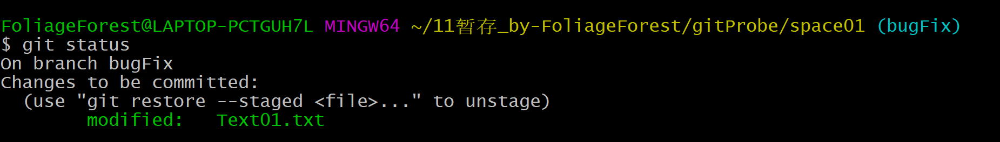
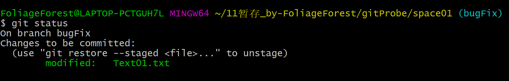

1. 直接修改工作区中的文件后，执行 `git status` 命令：  

2. 执行 `git add *` 后，再执行 `git status` 命令：  
  

在合适的目录执行命令 `git init <文件名> && cd <仓库目录> && git config user.name "FoliageForest@LAPTOP-PCTGUH7L" && git config user.email "123456@qq.com"`，完成仓库的初始化和基础配置。  
